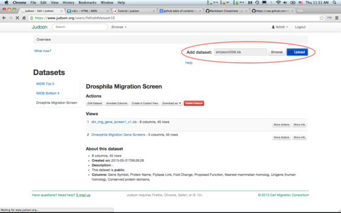
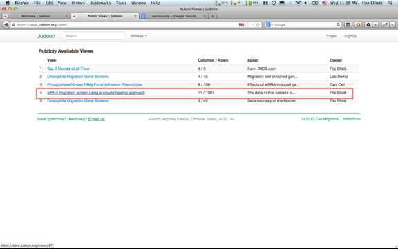
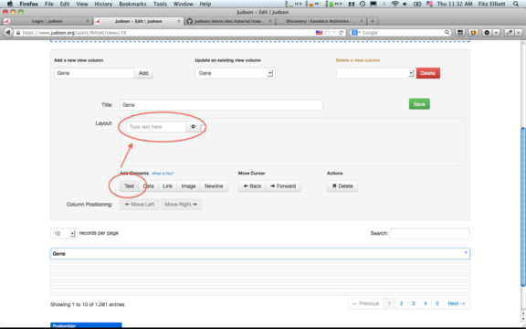
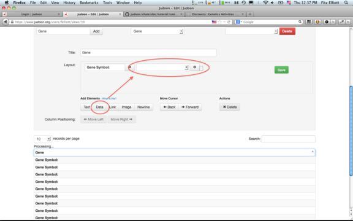
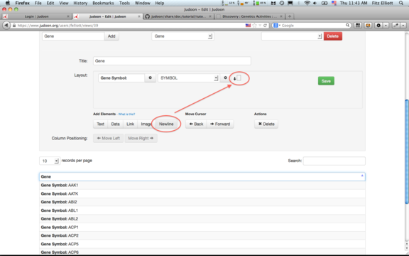

**Table of Contents**  *generated with [DocToc](http://doctoc.herokuapp.com/)*

- [Quick start: or spreadsheet-to-webpage in 10 seconds](#quick-start-or-spreadsheet-to-webpage-in-10-seconds)
- [Customizing our view](#customizing-our-view)
- [Publishing our data](#publishing-our-data)
- [Fancier views: adding emphasis, links, & images](#fancier-views-adding-emphasis-links-&-images)
- [Annotating data for easier linking](#annotating-data-for-easier-linking)
- [Joining other datasets](#joining-other-datasets)
- [Hosting your own webpage](#hosting-your-own-webpage)
- [Formatting your spreadsheet](#formatting-your-spreadsheet)

## Quick start: or spreadsheet-to-webpage in 10 seconds

Now we'll walk you through an example of building a **view**.

First, we'll need a sample data set.  We're going to start by turning
[this Excel spreadsheet](data/simpson2008.xls) containing siRNA
migration screen data into a simple, searchable data table.  First, we
login to our Judoon account, which will take us to this page:

[(fullsize)](./img/fullsize/quickstart-overview.png)

Next, we in the click on the `Browse` button next to **Add Dataset**
button and select our spreadsheet.

[(fullsize)](./img/fullsize/quickstart-upload.png)

Click `Upload`, and then you will be taken to a page that looks like
this:

[(fullsize)](./img/fullsize/quickstart-view.png)

**Presto!** You now have a searchable, sortable data
table!  Try typing in the search bar to see how the displayed rows
automatically get filtered. Click on the up/down arrows next to the
column names to changes the sort order of the data.

[(fullsize)](./img/fullsize/quickstart-table-fun.png)

Next, lets look at how to customize the header, preamble, and
postamble on our view.

## Customizing our view

A dynamic table is great, but you probably want to customize it beyond
the boilerplate provided.  Click on the `Edit` tab, and your screen
will look like this:

[(fullsize)](./img/fullsize/customizing-edit.png)

To change the **title**, click on the text and a toolbar with formatting
buttons will appear.  Type whatever text you like inside the box.

[(fullsize)](./img/fullsize/customizing-title.png)

You can highlight portions of the text and use the buttons to set
the inline formatting that you want.  Available options include:
bolding, italics, underlining, strikethroughs, superscripts, and
subscripts.

[(fullsize)](./img/fullsize/customizing-title-style.png)

Next, edit the **preamble**.  Editing the preamble is a lot like
editing the title, but with many more formatting options available to
you.

[(fullsize)](./img/fullsize/customizing-preamble.png)

We'll ignore the column editing for now.  If you'd like to jump ahead,
see [Fancier views](#fancier-views). At the bottom of the page is the
**postamble**, which you can edit just like the preamble.

[(fullsize)](./img/fullsize/customizing-postamble.png)

When you're done editing, click the `Save` button, and you'll be
notified that your changes have been saved.

[(fullsize)](./img/fullsize/customizing-click-save.png)

[(fullsize)](./img/fullsize/customizing-saved.png)

Click on the `Preview` tab and you can see your new view as it will
appear in all it's awesome glory!

[(fullsize)](./img/fullsize/customizing-preview.png)

Now, we'll talk about making our new view publicly available.
    
## Publishing our data

Sharing is what makes the web so wonderful!  Let's allow the world to
see the data we've worked so hard to generate.  Above the **title** is
a button that says `Public` and `Private`.  Click `Public`, then click
the `Save` button.

[(fullsize)](./img/fullsize/publishing-button.png)

A message will appear to let you know that making your page public
will necessarily make the underlying dataset public.  If this is
acceptable, click `OK`.  If not, you can continue to use Judoon, but
no one else will be able to see your data.

[(fullsize)](./img/fullsize/publishing-confirm.png)

Our dataset has been made public!

[(fullsize)](./img/fullsize/publishing-saved.png)

Now logout so we can see what the general public sees.  This will take
us to the frontpage.

[(fullsize)](./img/fullsize/publishing-logout.png)

[(fullsize)](./img/fullsize/publishing-index.png)

In the navigation bar across the top, click on `Browse` &gt; `Public
Views`.

[(fullsize)](./img/fullsize/publishing-viewnav.png)

This will show us a list of all public views.

[(fullsize)](./img/fullsize/publishing-publiclist.png)

Click on the view we just created, and you can see how our view
appears to the general public.

[(fullsize)](./img/fullsize/publishing-publicview.png)

We have now turned our spreadsheet into a searchable, sortable webpage
that is shared with the world.  That's pretty nifty, but the real
power of the web is in providing links to other related resources.
Which brings us to our next section...

## Fancier views: adding emphasis, links, & images

Let's build a new view with a more compact formatting and hyperlinks.
First, log back in, select your dataset from the tabs on the left,
then click on `Create a Custom View`.

[(fullsize)](./img/fullsize/fancy-newview.png)

A new view called *New View* will appear in your list of views.  Click
on the title to see it. The new view will be completely blank.

[(fullsize)](./img/fullsize/fancy-viewadded.png)

[(fullsize)](./img/fullsize/fancy-blankview.png)

Click the `Edit` tab, add a **title** and **preamble**, and save it.

[(fullsize)](./img/fullsize/fancy-addtitle.png)

Now we'll add our first column.  In the box labeled *Add a new view
column*, type the name of your new column (in this case, *Gene*), and
click `Add`.

[(fullsize)](./img/fullsize/fancy-newcolumn.png)

You'll see boxes for the **Title** and **Layout**, and a new empty
column will be inserted into the table.

[(fullsize)](./img/fullsize/fancy-columnadded.png)

The **title** is the title of the column in the table.  If you make
changes to it, you can see them reflected immediately in the table
below.

[(fullsize)](./img/fullsize/fancy-coltitlechange.png)

For now, we'll let the column be called *Gene*.  The **Layout** canvas
is where the really interesting stuff happens.  The buttons below `Add
Elements` let us add both static and variable pieces of text into our
column layout.  Static elements will be reproduced exactly as they
appear in every row of the column.  An example of a static element
would be a label.  Let's start by adding such a label. Click the
`Text` button, and an input box will appear in the **Layout** panel.

[(fullsize)](./img/fullsize/fancy-textwidget.png)

Now click inside the input box and type "*Gene Symbol:*".  Notice how
after you type, the text "*Gene Symbol:*" appears in every row below
the table.  `Text` elements are static elements and always appear
exactly as typed.

[(fullsize)](./img/fullsize/fancy-addtext.png)

We'd like this label to stand out a bit from the later content, so
let's take this opportunity to add some formatting to it.  Click on
the gear symbol to the right of the input box and select `Bold`.
Notice that after we select it, all of the "*Gene Symbol:*" text in
the table below is automatically bolded.

[(fullsize)](./img/fullsize/fancy-textformat.png)

[(fullsize)](./img/fullsize/fancy-textbold.png)

The other type of element that we can add is a variable element.  A
variable element is one that changes for each row, based on the data
in the underlying dataset.  With variable elements, we'll have to
specify which dataset column to pull our data from.  An example of a
variable element is the `Data` element.  This lets us put unadorned
data from our dataset directly into our table.  Click the `Data`
element and a dropdown box will appear in the **Layout** panel.  When
you click on the dropdown, you'll see a list of all of the columns in
the underlying dataset.

[(fullsize)](./img/fullsize/fancy-adddata.png)

[(fullsize)](./img/fullsize/fancy-selectdata.png)

Select *Symbol*.  Notice how when you do, new text appears in every
row of the table below.  This text is different for every row, because
it is coming from the *SYMBOL* field of our dataset.

[(fullsize)](./img/fullsize/fancy-datachosen.png)

Oops! Our label and our data are run together.  To separate them,
click in the `Text` element and add a space after the colon.

[(fullsize)](./img/fullsize/fancy-textspace.png)

Next, we'll add another static element, a `Newline`. A `Newline` is
just a linebreak.  When you click the `Newline` button, a down arrow
will appear on the canvas to let you know that it is there.

[(fullsize)](./img/fullsize/fancy-addnewline.png)

Add another `Text` element with the text "*Entrez Gene:*".

[(fullsize)](./img/fullsize/fancy-secondtext.png)

Now the moment we've all been waiting for, **links**!

[(fullsize)](./img/fullsize/fancy-.png)

## Annotating data for easier linking

[(fullsize)](./img/fullsize/0.png)

## Joining other datasets

[(fullsize)](./img/fullsize/0.png)

## Hosting your own webpage

[(fullsize)](./img/fullsize/0.png)

## Formatting your spreadsheet

One worksheet, worksheet name == dataset name (changable later), first
row is column headers, all following rows are data.

For now, columns are immutable, so trim anything you don't want to
upload.

[(fullsize)](./img/fullsize/spreadsheet-sample.png)
